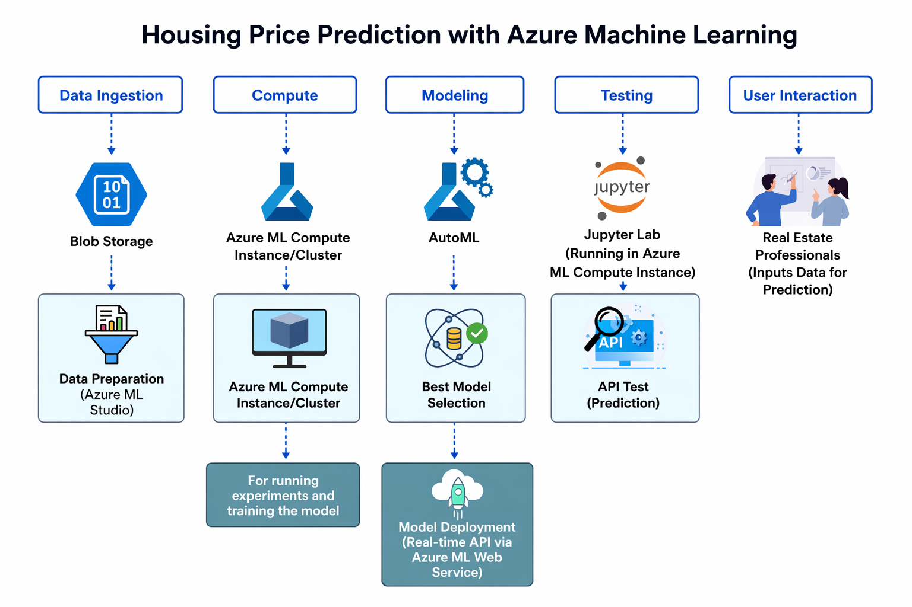
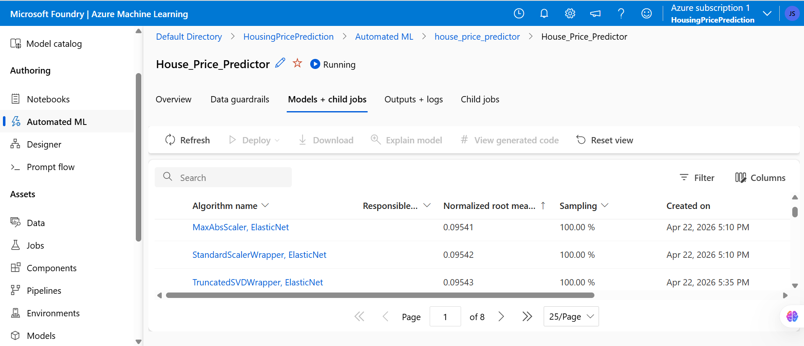
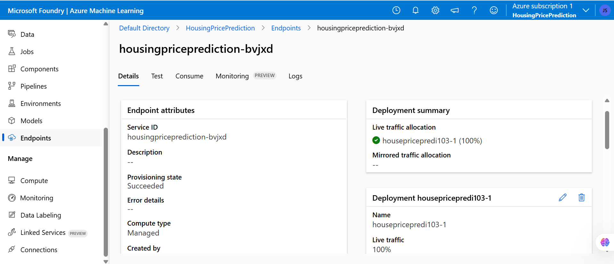
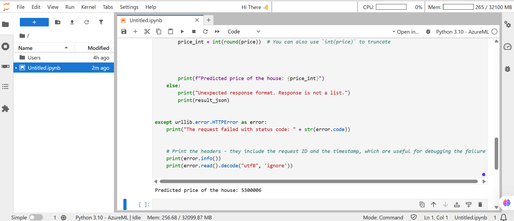

# 🏡 Azure ML Housing Price Prediction (End-to-End)

## 🚀 Project Overview

This project demonstrates an **end-to-end Machine Learning solution on Microsoft Azure**, from data ingestion through Azure Blob Storage to a live real-time prediction API — built and delivered by a Technical Project Manager to bridge AI/ML theory with real-world cloud delivery.

## 🎯 Business Problem

Real estate stakeholders need accurate property price predictions to improve pricing strategies, reduce investment risk, and enable data-driven decisions.

## 🧠 Solution Architecture



**Pipeline:**
1. Data ingestion from Azure Blob Storage
2. Dataset registration in Azure ML Studio
3. AutoML regression experiment (25 trials, 5-fold CV)
4. Best model selection based on Normalized RMSE
5. Real-time managed endpoint deployment
6. API consumption via Python (Jupyter Notebook)

## ⚙️ Tech Stack

| Layer | Technology |
|-------|-----------|
| Cloud Platform | Azure Machine Learning (Microsoft Foundry) |
| ML Training | AutoML (Regression) |
| Best Model | MaxAbsScaler + ElasticNet |
| Storage | Azure Blob Storage |
| Compute | Standard_D2a_v4 (Azure ML Compute Cluster) |
| Inference | Azure Managed Online Endpoint (REST API) |
| Notebook | Python 3.10 — Jupyter Lab (Azure ML) |

## 📊 Model Results

**Experiment:** `house_price_predictor`  
**Task:** Regression  
**Target:** Housing Price (INR)  
**Primary Metric:** Normalized RMSE  

| Rank | Algorithm | Normalized RMSE | Sampling |
|------|-----------|----------------|----------|
| 🥇 1 | MaxAbsScaler, ElasticNet | **0.09541** | 100% |
| 2 | StandardScalerWrapper, ElasticNet | 0.09542 | 100% |
| 3 | TruncatedSVDWrapper, ElasticNet | 0.09543 | 100% |

*AutoML evaluated 8 pages of model candidates (25/page) across LightGBM, XGBoost, ElasticNet, and ensemble variants.*

## 🚀 Deployment

| Property | Value |
|----------|-------|
| Endpoint Name | `housingpriceprediction-bvjxd` |
| Deployment | `housepricepredi103-1` |
| Provisioning State | ✅ Succeeded |
| Compute Type | Managed |
| Live Traffic | 100% |

### Screenshots

**AutoML Run — Models + Child Jobs**


**Endpoint Deployment**


**Live API Prediction Output**


## 🔗 API Usage

```python
import urllib.request, json

url     = "https://housingpriceprediction-bvjxd.australiaeast.inference.ml.azure.com/score"
api_key = "<your-endpoint-key>"

data = {
    "input_data": {
        "columns": [
            "sqft_living", "sqft_lot", "bedrooms", "bathrooms",
            "floors", "waterfront", "view", "condition",
            "grade", "yr_built", "yr_renovated", "zipcode",
            "lat", "long", "sqft_above", "sqft_basement", "location_type"
        ],
        "data": [
            [2000, 5000, 3, 2, 1, 0, 0, 3, 7, 2000, 0, 98052, 47.6, -122.1, 2000, 0, "suburban"]
        ]
    }
}

body = json.dumps(data).encode("utf-8")
req  = urllib.request.Request(url, body)
req.add_header("Content-Type", "application/json")
req.add_header("Authorization", f"Bearer {api_key}")

result = urllib.request.urlopen(req)
result_json = json.loads(result.read().decode("utf-8"))
print(f"Predicted price of the house: {int(round(result_json[0]))}")
# Output: Predicted price of the house: 5300006
```

## 📁 Repository Structure

```
Azure-ML-House-Price-Prediction/
├── azure_ml_housing_price_prediction.ipynb  # Full end-to-end notebook
├── requirements.txt                          # Python dependencies
├── .gitignore                                # Git ignore rules
├── architecture-diagram.png                  # Solution architecture
├── automl-run.png                            # AutoML experiment screenshot
├── endpoint.png                              # Endpoint deployment screenshot
├── api-prediction-output.png                 # Live prediction output screenshot
└── data/
    └── sample_housing_data.csv               # Sample dataset (20 rows)
```

## 🏃 How to Run

```bash
# 1. Clone the repo
git clone https://github.com/JaswantOnGit/Azure-ML-House-Price-Prediction.git
cd Azure-ML-House-Price-Prediction

# 2. Install dependencies
pip install -r requirements.txt

# 3. Open the notebook
jupyter notebook azure_ml_housing_price_prediction.ipynb

# 4. Update SUBSCRIPTION_ID, RESOURCE_GROUP, and WORKSPACE_NAME in Cell 2
# 5. Run cells sequentially
```

## 💡 Key Learnings (PM Perspective)

- 💰 **Cost governance** in cloud ML is critical — decommissioned resources immediately after testing
- ⚠️ **Quota & region constraints** are real delivery risks in enterprise ML projects
- 🚀 **Deployment is harder than training** — managing endpoints, traffic allocation, and auth requires careful orchestration
- 🔄 **DS → Engineering handoff** requires strong ownership and clear API contracts
- 📊 **AutoML democratizes modeling** but a PM still needs to validate metric choices and business alignment
